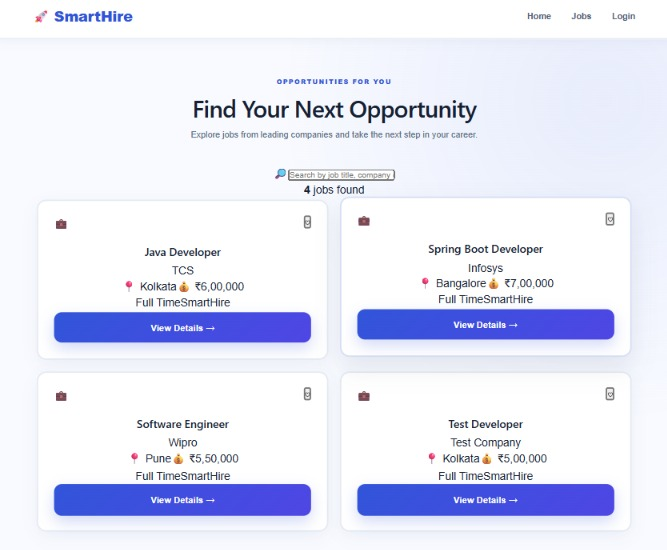

# SmartHire 🚀

SmartHire is a full-stack recruitment management system that connects candidates and recruiters through a modern web application.

It allows candidates to explore job opportunities, create an account, apply for jobs, and track their applications. Recruiters can manage job listings and review candidate applications through a dedicated dashboard.

## ✨ Features

### 👤 Candidate

* Candidate registration and login
* JWT-based authentication
* Browse available jobs
* Search jobs
* View detailed job information
* Apply for jobs
* Prevent duplicate applications
* View application status
* Candidate dashboard

### 🧑‍💼 Recruiter

* Recruiter login
* Recruiter dashboard
* View posted jobs
* View total applicants
* Review application statistics
* Manage recruitment-related information

### 🔐 Authentication & Security

* Spring Security
* JWT authentication
* Role-based authorization
* Candidate and Recruiter roles
* Password encryption using BCrypt
* Protected API endpoints
* CORS configuration
* Environment variables for sensitive configuration

## 🛠️ Tech Stack

### Backend

* Java 21
* Spring Boot
* Spring Security
* Spring Data JPA
* Hibernate
* JWT
* Maven

### Database

* MySQL

### Frontend

* React
* Vite
* React Router
* JavaScript
* CSS

### Tools

* Git
* GitHub
* Postman
* VS Code

## 🏗️ Project Structure

```text
SmartHire/
│
├── src/
│   ├── main/
│   │   ├── java/
│   │   │   └── com/smarthire/smarthire/
│   │   │       ├── config/
│   │   │       ├── controller/
│   │   │       ├── dto/
│   │   │       ├── exception/
│   │   │       ├── model/
│   │   │       ├── repository/
│   │   │       └── service/
│   │   │
│   │   └── resources/
│   │       └── application.properties
│   │
│   └── test/
│
├── smarthire-frontend/
│   ├── src/
│   │   ├── pages/
│   │   ├── App.jsx
│   │   ├── App.css
│   │   └── api.js
│   │
│   ├── public/
│   ├── package.json
│   └── vite.config.js
│
├── screenshots/
│   ├── home.png
│   └── jobs.png
│
├── pom.xml
├── .gitignore
└── README.md
```

## 📌 Main Modules

### Authentication

```text
POST /auth/register
POST /auth/login
```

### Jobs

```text
GET    /jobs
GET    /jobs/{id}
POST   /jobs
PUT    /jobs/{id}
DELETE /jobs/{id}
```

### Applications

```text
POST /applications
GET  /applications/candidate/{candidateId}
GET  /applications/job/{jobId}
PUT  /applications/{id}/status
```

### Recruiters

```text
GET /recruiters
```

### Interviews

```text
POST /interviews
```

> API endpoints may require authentication depending on the user's role.

## 🔑 Environment Configuration

Sensitive configuration is not stored directly in the repository.

The backend uses environment variables for database and JWT configuration.

Example:

```properties
spring.datasource.username=root
spring.datasource.password=${DB_PASSWORD}

jwt.secret=${JWT_SECRET}
```

Set the required environment variables before running the backend.

## 🚀 How to Run the Backend

### 1. Clone the Repository

```bash
git clone https://github.com/mondalshreya413-crypto/SmartHire.git
cd SmartHire
```

### 2. Configure MySQL

Create the database:

```sql
CREATE DATABASE smarthire_db;
```

Configure your database credentials using environment variables.

### 3. Set Environment Variables

Windows CMD example:

```bat
set DB_PASSWORD=YOUR_DATABASE_PASSWORD
set JWT_SECRET=YOUR_JWT_SECRET
```

### 4. Start the Spring Boot Application

```bash
mvn spring-boot:run
```

Backend runs on:

```text
http://localhost:8080
```

## 💻 How to Run the Frontend

Open another terminal:

```bash
cd smarthire-frontend
```

Install dependencies:

```bash
npm install
```

Start the development server:

```bash
npm run dev
```

Frontend runs on:

```text
http://localhost:5173
```

## 🧪 Build Verification

Backend package:

```bash
mvn package -DskipTests
```

Frontend production build:

```bash
npm run build
```

Both backend packaging and frontend production build were successfully verified during development.

## 📱 Application Pages

SmartHire includes:

* Home
* Jobs
* Job Details
* Login
* Register
* Forgot Password
* Candidate Dashboard
* Recruiter Dashboard

## 📸 Screenshots

### Home Page


### Jobs Page



## 🔄 Application Flow

### Candidate Flow

```text
Candidate
   ↓
Register / Login
   ↓
JWT Authentication
   ↓
Browse Jobs
   ↓
View Job Details
   ↓
Apply for Job
   ↓
Track Application
```

### Recruiter Flow

```text
Recruiter
   ↓
Login
   ↓
JWT Authentication
   ↓
Recruiter Dashboard
   ↓
View Jobs
   ↓
Review Applicants
   ↓
Manage Recruitment Process
```

## 🎯 Project Goal

The goal of SmartHire is to demonstrate how a real-world recruitment platform can be designed using a Java Spring Boot backend and a React frontend.

The project focuses on:

* REST API development
* Database integration
* Authentication and authorization
* JWT security
* Role-based access control
* Frontend-backend integration
* Exception handling
* CRUD operations
* Responsive UI development

## 🔮 Future Improvements

Possible future enhancements include:

* Advanced job filtering
* Recruiter job creation UI
* Resume upload
* Email notifications
* Interview scheduling UI
* Application analytics
* Admin dashboard
* Cloud deployment
* Automated testing
* CI/CD pipeline

## 👩‍💻 Author

**Shreya Mondal**

B.Tech Information Technology

## 📄 License

This project is created for educational and portfolio purposes.
